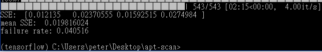
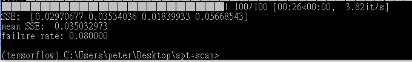

# apt-scan

### Training:

### Wrapping:

### Loss:

### Evaluation (lower is better):

Use same parameters in [demo site](https://github.com/peter0749/apt-scan-demo/blob/master/demo/unwrap/models.py)

##### SSE (corner wise): up-left, up-right, down-right, down-left

##### mean SSE: mean value of SSE

##### failure rate: \#failure / \#total

(training)

(validation)