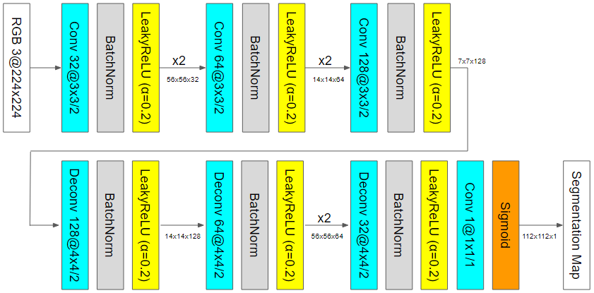
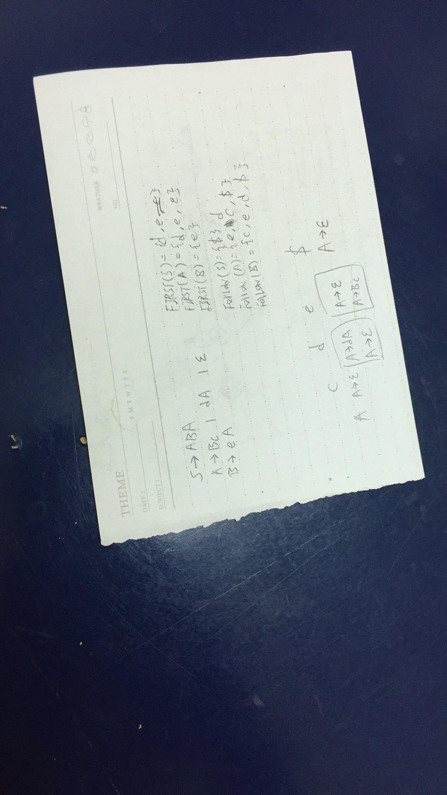
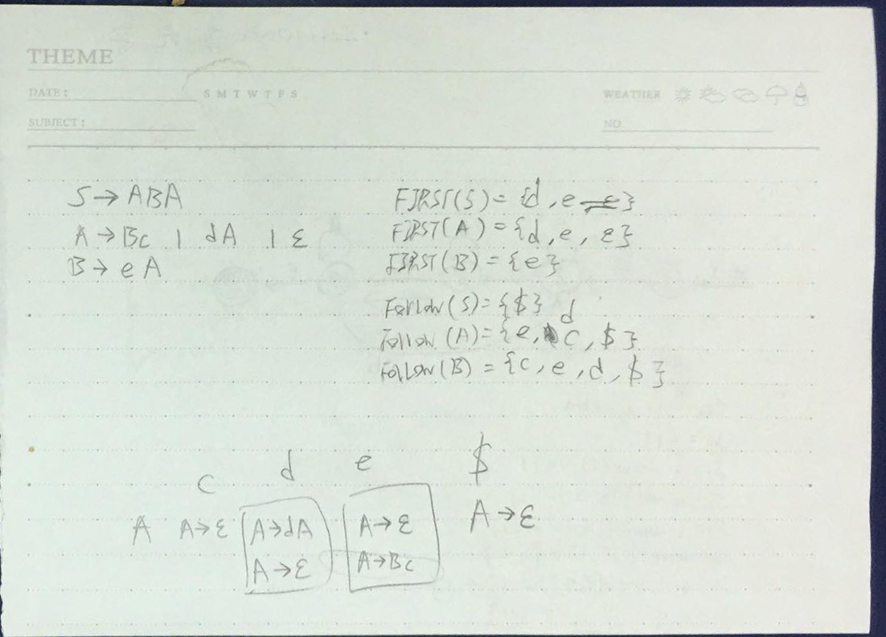
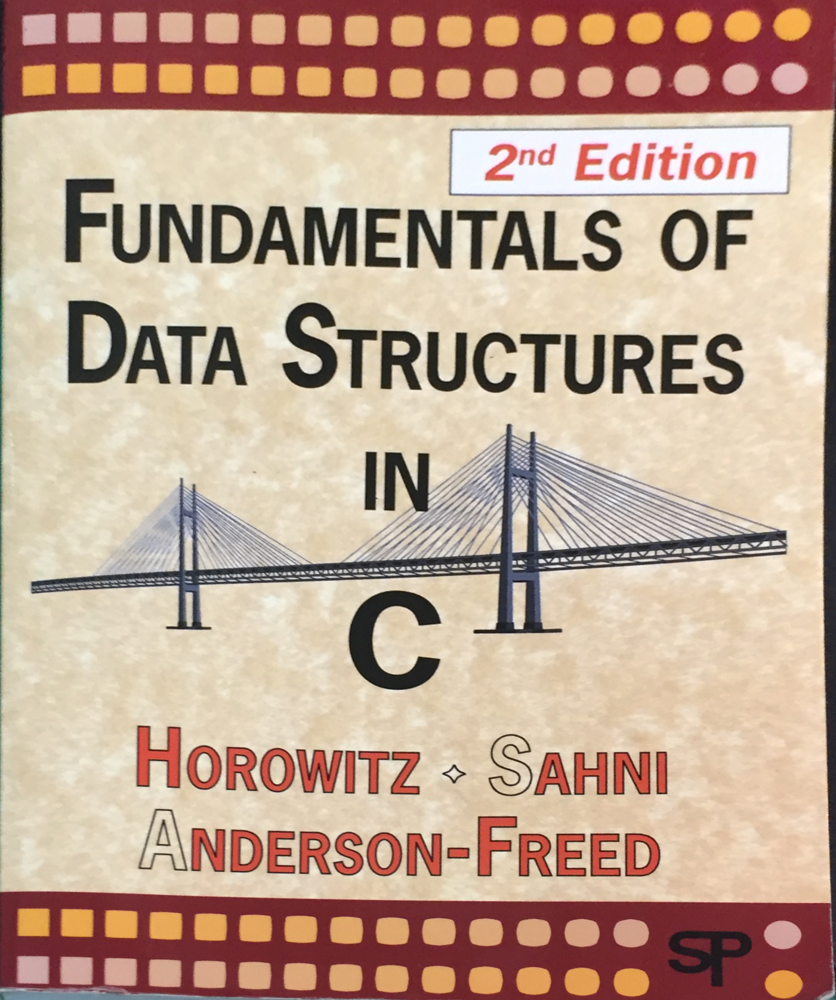
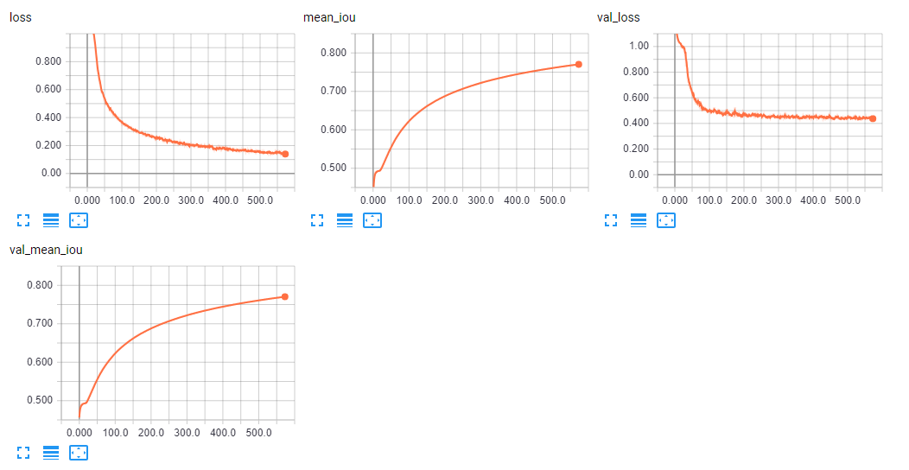

# apt-scan

### Find corners:

### Model layout:

### Warpping:

### Loss:

### Evaluation (lower is better):

Use same parameters in [demo site](https://github.com/peter0749/apt-scan-demo/blob/master/demo/unwrap/models.py)

##### MSE (corner wise): up-left, up-right, down-right, down-left

##### mean MSE: mean value of MSE

##### failure rate: \#failure / \#total

|            | *TL*     | *TR*     | *DR*     | *DL*     | *mean MSE* | *failure rate* |
|------------|--------|--------|--------|--------|----------|--------------|
| *Training*   | 0.0121 | 0.0237 | 0.0159 | 0.0275 | 0.0198   | 0.0405       |
| *Validation* | 0.0297 | 0.0353 | 0.0184 | 0.0567 | 0.0350   | 0.0800       |
