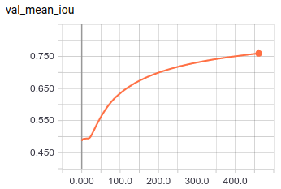

# apt-scan

### Find corners:

### Warpping:

### Loss:

### Evaluation (lower is better):

##### MSE (corner wise): top-left, top-right, down-right, down-left

##### mean MSE: mean value of MSE

##### failure rate: \#failure / \#total

|            | **TL**     | **TR**     | **DR**     | **DL**     | **mean MSE** | **failure rate** |
|------------|--------|--------|--------|--------|----------|--------------|
| **Training**   | 0.00371909 | 0.00315485 | 0.00276901 | 0.00619295 | 0.0039589726 | 0.005525 |
| **Validation** | 0.00353955 | 0.00050486 | 0.00318895 | 0.00579515 | 0.003257126 | 0 |

### Model

